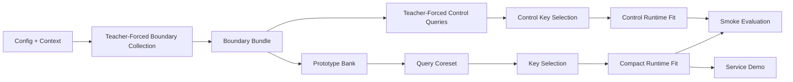

# Architecture

## Scope

`qwen35_clean` carries one default story:

- model: `Qwen3.5-9B`
- surface: `qwen35_smoke_v1`
- paths:
  - full-cache reference
  - compacted sketch
  - explicit teacher-forced control

It also carries one minimal interactive path:

- `qwen35_service_demo`

The repo keeps the protocol from the Qwen2.5 clean lane but calibrates the
prompt surface natively for the Qwen3.5 family.

## Data Flow

1. Config and context loading
   - `config.py`
   - `context_loader.py`

2. Boundary collection
   - `boundary_collection.py`
   - teacher-forced eager prefill over the prefix
   - captures real query rows and prefix mass from the model forward pass
   - materializes boundary key/value rows from the final cache

3. Sketch state
   - `prototype_bank.py`
   - accumulates query-conditioned observations into a compact prototype bank

4. Query source extraction
   - `coreset.py`
   - extracts the sketch-derived query coreset
   - `query_controls.py`
   - derives the explicit teacher-forced control query source

5. Key selection
   - `key_selection.py`
   - supports `highest_attention` and `omp`
   - `head_budget.py`
   - resolves per-head budgets

6. Runtime fitting
   - `runtime_compaction.py`
   - fits per-head compact keys, `beta`, and compact values
   - produces the compact runtime objects used at continuation time

7. Evaluation / demo
   - `behavioral_eval.py`
   - reruns the Qwen3.5-native smoke surface over:
     - reference
     - sketch
     - control
   - `service_demo.py`
   - exposes the same compacted runtime through a small CLI shell

## Boundary Bundle

The most important stable interface in this repo is the boundary bundle:

- `harvest`
- `query_bank`
- boundary `K`
- boundary `V`
- projected boundary values
- raw output targets

Everything downstream of collection runs on that bundle rather than reaching
back into model internals.

## Design Choices

The repo currently prefers:

- eager teacher-forced boundary collection for reproducibility
- native Qwen3.5 prompt calibration over inherited Qwen2.5 prompts
- explicit control paths over hidden heuristics
- a small set of composable modules over a research-style orchestration layer

## Current Limits

The current demonstrated run does not yet show sketch beating the explicit
control path. On the validated Qwen3.5-9B run, sketch and control both land at
`3/4` while reference lands at `4/4`.

This repo also does not package the research repo's separate low-overhead live
generation observer result. The public story here is narrower:

- boundary-triggered compaction
- teacher-forced boundary evidence
- sketch vs explicit control on a Qwen3.5-native smoke surface
